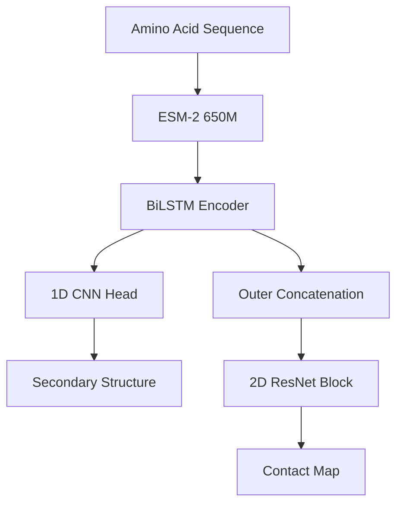

<div align="center">
  
  <h1>🧬 FoldNet</h1>
  <p><strong>Deep Learning for Protein Secondary Structure and Contact Map Prediction</strong></p>

  [](https://pytorch.org/)
  [](https://fastapi.tiangolo.com/)
  [](https://github.com/facebookresearch/esm)
</div>

---

## ⚡ What is FoldNet?

**FoldNet** is an end-to-end multi-task deep learning framework. It takes a raw protein amino acid sequence and predicts:
1. **Secondary Structure** (Helix, Sheet, Coil)
2. **Residue-Level Contact Maps** (Probability of residues interacting < 8Å)

It leverages the massive **650M parameter ESM-2 language model** to extract rich sequence features, passing them through highly optimized **BiLSTM** and **CNN** backbones.

---

## 🌟 The FoldNet Dashboard (NEW!)

We've built a professional, presentation-ready web dashboard to interact with FoldNet!

*   🔮 **Live Predictor:** Paste *any* amino acid sequence. The dashboard extracts ESM-2 features on the fly and predicts the structure instantly.
*   📊 **Interactive Visualisations:** Beautiful, responsive residue-by-residue secondary structure bars and Plotly heatmaps for contact probabilities.
*   🔍 **Test Set Error Analysis:** Browse the CB513 test set. Instantly compare Ground Truth vs. Predictions with a custom **Red-Blue Difference Heatmap** to spot model errors.
*   📈 **Downloadable Reports:** View our architecture and export full validation benchmarks to CSV with a single click.

### 🚀 How to Run the Dashboard

1. **Install Requirements:**
   Ensure you have all dependencies, including `fair-esm` and `fastapi`:
   ```powershell
   pip install -r requirements.txt
   pip install fair-esm fastapi uvicorn
   ```

2. **Start the Server:**
   ```powershell
   uvicorn viewer.app:app --reload
   ```

3. **Open your Browser:**
   Navigate to 👉 **[http://127.0.0.1:8000](http://127.0.0.1:8000)**

*(Note: The first time you run a prediction, it will take a few minutes to download the 2.6GB ESM-2 model weights in the background).*

---

## 🏗️ Project Architecture



---

## 🏆 Performance Benchmarks (CB513 Test Set)

Tested strictly on unseen PDB sequences.

| Architecture | Q3 Accuracy (%) | MCC (Macro) | Precision@L |
| :--- | :--- | :--- | :--- |
| **CNN (Residual)** | **83.66%** | **0.7448** | 0.0258 |
| **BiLSTM (Best)** | 82.55% | 0.7270 | **0.1022** |
| **Transformer** | 82.93% | 0.7326 | 0.0226 |

---

## 👥 The Team

*   **Shubham** — Data Engineering & Feature Extraction
*   **Shivam** — Model Architecture & Multi-task Loss
*   **Tanishka** — Evaluation Metrics & Quantitative Analysis
*   **Vaibhav** — Master Pipeline, Dashboard, & Integration

---
*Developed for the Advanced Bioinformatics Modeling Project.*
