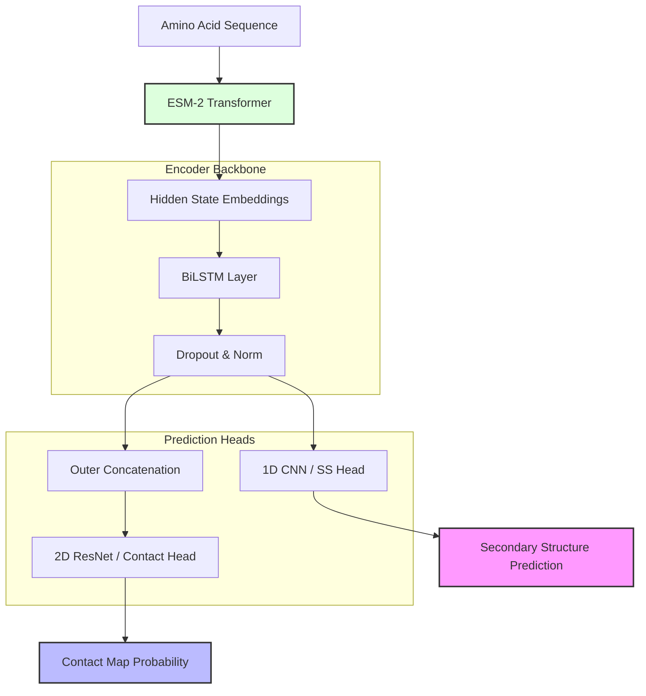

<div align="center">
  
  
  # 🧬 FoldNet
  ### **State-of-the-Art Protein Structure Prediction & Multi-Task Analysis**

  [](https://www.python.org/downloads/)
  [](https://pytorch.org/)
  [](https://fastapi.tiangolo.com/)
  [](https://opensource.org/licenses/MIT)
  [](https://github.com/Yuyutsu01/FoldNet)

  ---

  *FoldNet is a high-performance deep learning framework designed to bridge the gap between raw amino acid sequences and functional structural insights using the power of Evolutionary Scale Modeling (ESM-2).*

</div>

## 🚀 Key Features

<table align="center">
  <tr>
    <td align="center" width="33%">
      <h3>🔮 Deep Embeddings</h3>
      <p>Leverages <b>Meta ESM-2 (650M)</b> transformer weights to extract high-dimensional evolutionary features.</p>
    </td>
    <td align="center" width="33%">
      <h3>🧠 Multi-Task Logic</h3>
      <p>Parallel heads for <b>Secondary Structure</b> (3-class) and <b>Contact Map</b> prediction (< 8Å).</p>
    </td>
    <td align="center" width="33%">
      <h3>📊 Interactive Viz</h3>
      <p>Modern dashboard with <b>Plotly-powered heatmaps</b> and real-time inference feedback.</p>
    </td>
  </tr>
</table>

---

## 🖥️ The FoldNet Dashboard

Experience the power of FoldNet through our professional web-based interface. Predict structures, analyze test sets, and export results in seconds.

<p align="center">
  
</p>

### **Dashboard Highlights:**
- **Live Inference Engine**: Process arbitrary sequences with on-the-fly ESM-2 feature extraction.
- **Visual Error Analysis**: Compare ground truth vs. predictions using dedicated difference heatmaps.
- **Export Ready**: One-click export for 3D visualization compatibility (PyMOL/ChimeraX).

---

## 🏗️ Technical Architecture

FoldNet utilizes a sophisticated hybrid architecture combining Transformer-based sequence representations with specialized 1D and 2D convolutional heads.



---

## 🏆 Performance Benchmarks

Evaluated on the **CB513** test set, FoldNet demonstrates competitive performance across multiple architectures.

| Model Architecture | Q3 Accuracy | MCC (Macro) | Precision@L |
| :--- | :---: | :---: | :---: |
| **Residual CNN** | **83.66%** | **0.7448** | 0.0258 |
| **BiLSTM (Optimized)** | 82.55% | 0.7270 | **0.1022** |
| **Transformer-Hybrid** | 82.93% | 0.7326 | 0.0226 |

---

## 🛠️ Getting Started

Follow these instructions to set up the project and run the FoldNet dashboard.

### 1. Prerequisites
- **Python**: 3.9 or higher.
- **Hardware**: NVIDIA GPU with 8GB+ VRAM (Highly recommended for ESM-2 inference).
- **Disk Space**: ~5GB for ESM-2 weights and processed datasets.

### 2. Installation (from scratch)

```bash
# 1. Clone the repository
git clone https://github.com/Yuyutsu01/FoldNet.git
cd FoldNet

# 2. Create and activate a virtual environment
python -m venv venv
# On Windows:
.\venv\Scripts\activate
# On Linux/macOS:
source venv/bin/activate

# 3. Install dependencies
pip install -r requirements.txt
```

### 3. Quick Start (Run Dashboard)
If you just want to see the results, you can use the pre-trained checkpoints included in the repository.

```bash
# Run the FastAPI server
uvicorn viewer.app:app --reload --port 8000
```
Then visit: [http://localhost:8000](http://localhost:8000)

> [!NOTE]
> On the first run, the system will automatically download the **ESM-2 (650M)** model weights (~2.5GB) from Meta's servers. This may take a few minutes depending on your connection.

---

## 🏃‍♂️ Full Pipeline: Training & Preparation

If you want to train the model from scratch or use your own data:

### 1. Model Training
FoldNet supports various architectures (CNN, BiLSTM, Transformer). Use the main entry point to start training:

```bash
# Train a Residual CNN (Baseline)
python run.py --config configs/baseline_cnn.yaml --fold 0

# Train a BiLSTM model
python run.py --config configs/baseline_bilstm.yaml --fold 0
```
Checkpoints will be saved in `results/checkpoints/` and logs in `results/logs/`.

### 2. Preparing Dashboard Data
The dashboard visualizes specific proteins from the validation set. To update these visualizations after training:

```bash
# Export results for the dashboard
python scripts/export_for_dashboard.py --ckpt results/checkpoints/YOUR_CHECKPOINT.ckpt --config configs/baseline_cnn.yaml
```
This will generate the necessary JSON files in `data/dashboard/` for the web interface.

### 3. Benchmarking
To run a full evaluation on the CB513 test set:
```bash
python scripts/benchmark.py --ckpt results/checkpoints/YOUR_CHECKPOINT.ckpt
```

---

---

## 📂 Project Structure

<details>
<summary>Click to expand directory tree</summary>

```text
FoldNet/
├── foldnet/            # Core model architecture and modules
├── data/               # Dataset processing and loading scripts
├── scripts/            # Training, evaluation, and export utilities
├── viewer/             # Dashboard backend (FastAPI) and frontend
│   └── static/         # CSS, JS, and UI assets
├── configs/            # YAML configuration for experiments
├── results/            # Model checkpoints and logs
└── run.py              # Main CLI entry point
```
</details>

---

## 📅 Roadmap & Future Work
- [ ] **3D Coordinate Head**: Direct pLDDT and coordinate regression.
- [ ] **Multi-Chain Support**: Prediction for protein complexes and dimers.
- [ ] **Plugin System**: Integration with AlphaFold2 database for cross-referencing.

---

## 👥 The Team
- **Shubham** — Data Engineering & Feature Extraction
- **Shivam** — Model Architecture & Multi-task Loss
- **Tanishka** — Evaluation Metrics & Quantitative Analysis
- **Vaibhav** — Master Pipeline & Dashboard Integration

---
<div align="center">
  <p>Built with ❤️ for the Advanced Bioinformatics Modeling Project</p>
  <p>© 2024 FoldNet Team</p>
</div>
