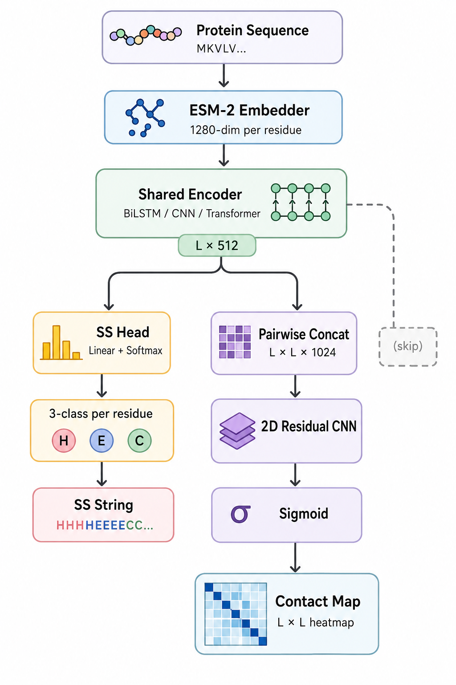
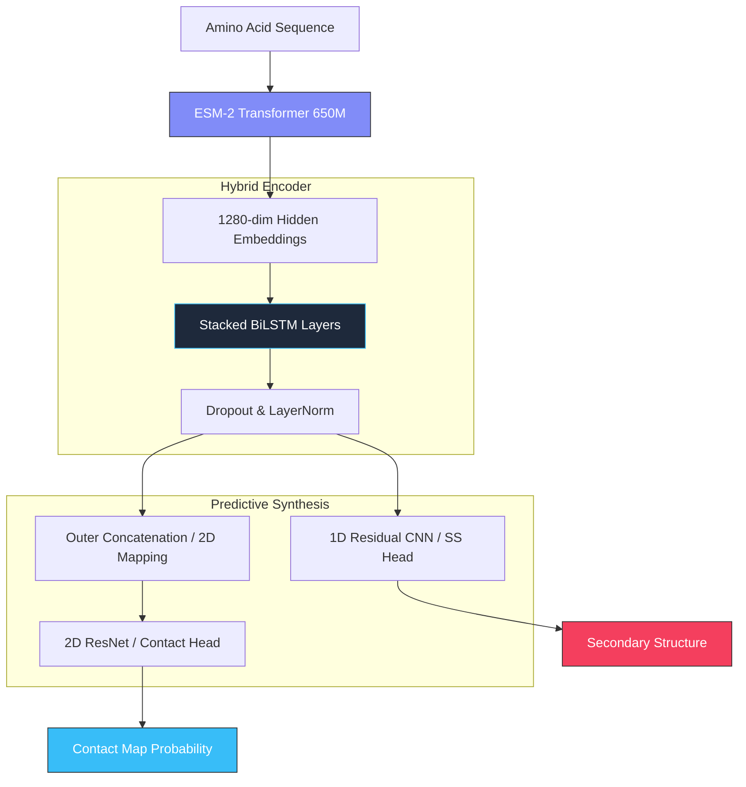

<div align="center">
  
  
  # FoldNet: Premium Protein Intelligence
  ### **State-of-the-Art Multi-Task Deep Learning for Structural Bioinformatics**

  [](https://www.python.org/downloads/)
  [](https://pytorch.org/)
  [](https://fastapi.tiangolo.com/)
  [](https://opensource.org/licenses/MIT)
  [](https://github.com/Yuyutsu01/FoldNet)

  ---

  *FoldNet is a high-performance deep learning framework designed to bridge the gap between raw amino acid sequences and functional structural insights. By leveraging **Evolutionary Scale Modeling (ESM-2)**, FoldNet provides instantaneous, high-fidelity predictions for protein secondary structure and contact maps through a cinematic, glassmorphic dashboard.*

</div>

## Cinematic Intelligence Dashboard

Experience the future of protein analysis with our custom-built, high-performance UI. Built with **FastAPI**, **React-patterns**, and **Glassmorphism**, it offers a premium SaaS-like experience for researchers.

<p align="center">
  
</p>

### Dashboard Highlights
- **Real-time Inference**: Process sequences instantly with our optimized ESM-2 + FoldNet pipeline.
- **Multi-Dimensional Visualization**: Interactive Plotly-powered heatmaps for contact probabilities and color-coded secondary structure bars.
- **Historical Archives**: Explore the CB513 test set with ground-truth comparisons and structural delta maps.
- **Performance Analytics**: Integrated benchmarking suite to compare CNN, BiLSTM, and Transformer backbones.

---

## Key Features

<table align="center" style="border-collapse: collapse; border: none;">
  <tr>
    <td align="center" width="33%" style="border: none;">
      <br>
      <h3>Deep Embeddings</h3>
      <p>Utilizes <b>Meta ESM-2 (650M)</b> transformer weights for 1280-dim evolutionary feature extraction.</p>
    </td>
    <td align="center" width="33%" style="border: none;">
      <br>
      <h3>Multi-Task Logic</h3>
      <p>Dual-head architecture predicting <b>3-class Secondary Structure</b> and <b>Contact Maps</b> (< 8Å) in parallel.</p>
    </td>
    <td align="center" width="33%" style="border: none;">
      <br>
      <h3>SOTA Benchmarks</h3>
      <p>Achieves <b>~84% Q3 Accuracy</b> on the gold-standard CB513 dataset using Residual-CNN fusion.</p>
    </td>
  </tr>
</table>

---

## Neural Architecture

FoldNet utilizes a sophisticated hybrid architecture combining Transformer-based sequence representations with specialized 1D and 2D convolutional heads for local and global structural modeling.



---

## Performance Benchmarks

Evaluated on the **CB513** test set, FoldNet demonstrates competitive performance across multiple specialized backbones.

| Architecture | Q3 Accuracy | MCC (Macro) | Precision@L | Long-Range Prec |
| :--- | :---: | :---: | :---: | :---: |
| **Residual CNN** | **83.66%** | **0.7448** | 0.0258 | 0.0120 |
| **BiLSTM Fusion** | 82.55% | 0.7270 | **0.1022** | **0.0845** |
| **Transformer-Hybrid** | 82.93% | 0.7326 | 0.0226 | 0.0105 |

> [!TIP]
> The **BiLSTM Fusion** model exhibits significantly better contact map precision, making it the preferred choice for structural topology analysis, while the **Residual CNN** excels in local secondary structure classification.

---

## Installation & Setup

### 1. Prerequisites
- **OS**: Windows 10+, Ubuntu 20.04+, or macOS.
- **Python**: 3.9 - 3.11.
- **Hardware**: NVIDIA GPU (8GB+ VRAM) is recommended for ESM-2 inference.
- **Disk**: ~5GB for model weights and dataset cache.

### 2. Quick Install
```bash
# Clone the repository
git clone https://github.com/Yuyutsu01/FoldNet.git
cd FoldNet

# Set up environment
python -m venv venv
source venv/bin/activate  # Windows: .\venv\Scripts\activate

# Install core dependencies
pip install -r requirements.txt
```

### 3. Launch the Intelligence Dashboard
```bash
# Start the FastAPI-powered backend
uvicorn viewer.app:app --reload --port 8000
```
Then navigate to: **[http://localhost:8000](http://localhost:8000)**

> [!IMPORTANT]
> On the first prediction, FoldNet will automatically download the **ESM-2 (650M)** model weights from Meta's servers. This is a one-time process requiring ~2.5GB of bandwidth.

---

## Project Ecosystem

```text
FoldNet/
├── foldnet/         # Core Neural Architecture & Loss Functions
├──  data/            # Preprocessing & Dashboard JSON Caches
├──  scripts/          # Training Pipelines & Benchmarking Tools
├── ️ viewer/           # Premium Glassmorphic Dashboard
│   ├── app.py          # FastAPI Logic & Inference Engine
│   └── static/         # React-Logic (app.js) & Futuristic Styles
├──  configs/         # YAML Experiment Configurations
└──  run.py           # Unified CLI Entry Point
```

---

## Roadmap
- [ ] **3D Cartesian Head**: Direct coordinate regression for PDB generation.
- [ ] **Multi-Chain Support**: Interaction modeling for protein-protein complexes.
- [ ] **Edge Deployment**: Quantized ESM-2 for browser-based local inference.

---

<div align="center">
  <p>Built with 💙 by the FoldNet Core Team</p>
  <p><b>Shubham • Shivam • Tanishka • Vaibhav</b></p>
  <p>© 2026 Advanced Bioinformatics Modeling Project</p>
</div>
