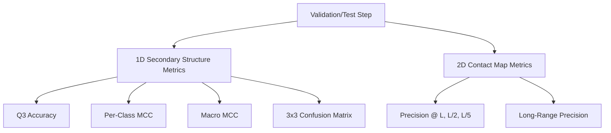
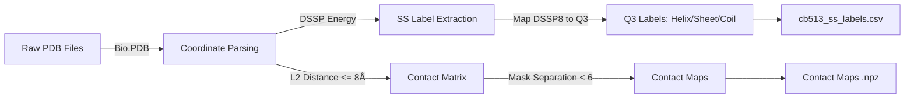
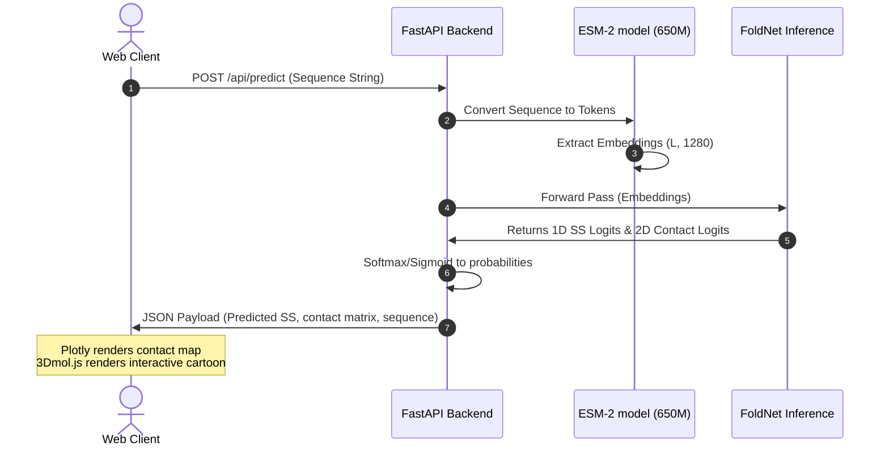

# FoldNet Evaluation Metrics, Training, and System Workflows

This document provides a detailed breakdown of all evaluation metrics, training configurations, and workflows implemented in FoldNet.

---

## 1. Evaluation Metrics

FoldNet uses separate evaluation metric suites for its 1D sequence annotation head (secondary structure) and its 2D spatial prediction head (residue-residue contact map). These metrics are defined and calculated in:
*   [metrics_ss.py](file:///c:/Users/shiva/OneDrive/Desktop/projects/FoldNet-1/foldnet/evaluation/metrics_ss.py) (Secondary Structure metrics)
*   [metrics_contacts.py](file:///c:/Users/shiva/OneDrive/Desktop/projects/FoldNet-1/foldnet/evaluation/metrics_contacts.py) (Contact Map metrics)



### 1.1 Secondary Structure (1D) Metrics
Secondary structure is classified into three states: Helix ($0$), Strand ($1$), and Coil ($2$).
*   **Q3 Accuracy**: The percentage of amino acid residues in a protein sequence predicted correctly:
    $$\text{Q3} = \frac{\text{Correctly predicted residues}}{\text{Total residues } L} \times 100\%$$
*   **Matthews Correlation Coefficient (MCC)**: Measures prediction quality while accounting for class imbalance:
    $$\text{MCC} = \frac{\text{TP} \times \text{TN} - \text{FP} \times \text{FN}}{\sqrt{(\text{TP}+\text{FP})(\text{TP}+\text{FN})(\text{TN}+\text{FP})(\text{TN}+\text{FN})}}$$
    *   **Per-Class MCC**: Evaluated for Helix, Strand, and Coil separately.
    *   **Macro MCC**: The average of the three per-class MCC values, preventing class-specific bias.
*   **3x3 Confusion Matrix**: Tracks misclassification patterns (e.g., sheets mispredicted as coils).

### 1.2 Contact Map (2D) Metrics
A contact is a physical interaction where the distance between $\text{C}_\beta$ atoms of two residues is $\le 8.0 \text{ \AA}$. Because contact maps are highly sparse (typically $<5\%$ of cells are actual contacts), standard accuracy is not used. Instead, the framework uses precision benchmarks.
*   **Precision@L / Precision@L/2 / Precision@L/5**: 
    1. Extracts the upper triangle indices of the predicted contact probability matrix (excluding the diagonal: $k=1$).
    2. Sorts predictions in descending order of confidence.
    3. Evaluates the percentage of true positive contacts within the top $L$, $L/2$, and $L/5$ predictions (where $L$ is sequence length).
*   **Long-Range Precision**: 
    Evaluates topological prediction quality. It measures Precision@L considering only long-range residue pairs (residues separated by at least 24 positions in sequence structure: $|i - j| \ge 24$).

---

## 2. Training Workflow

The training workflow is managed by PyTorch Lightning and orchestrated in [train.py](file:///c:/Users/shiva/OneDrive/Desktop/projects/FoldNet-1/foldnet/models/train.py).

### 2.1 Initialization & Trainer Settings
*   **Accelerators**: Dynamically shifts between `gpu` (using CUDA) and `cpu`.
*   **Mixed Precision**: Operates on `16-mixed` floating-point precision on GPUs to reduce memory consumption, and `32-true` on CPU.
*   **TensorFloat-32 (TF32)**: Configured via `torch.set_float32_matmul_precision('medium')` to accelerate matrix multiplications on modern NVIDIA Tensor Cores.
*   **Gradient Accumulation**: Accumulates gradients over `accumulate_grad_batches = 4` steps to simulate a batch size of 16 while keeping the active hardware memory footprint small.
*   **Gradient Clipping**: Clips gradients at a maximum norm of `1.0` to prevent exploding gradients in recurrent (LSTM) or attention (Transformer) structures.

### 2.2 Epoch Execution Step

```
For each training batch:
  1. Retrieve Features (B, L, 1280), SS Labels (B, L), Contact maps (B, L, L), Mask (B, L)
  2. Forward Pass: SS Logits, Contact Logits = model(features, mask)
  3. Calculate Multi-Task Loss:
       Loss = SS_Loss + lambda_contact * Contact_Loss
  4. Backward Pass (accumulating gradients over 4 batches)
  5. Apply Gradient Clipping (max_norm = 1.0)
  6. Optimizer Step (AdamW) & Scheduler Step (Sequential Warmup + Cosine Decay)
```

### 2.3 Optimization & Scheduling
*   **Optimizer**: `AdamW` with decoupled weight decay to handle regularization mathematically correctly.
*   **Sequential Scheduler**:
    1.  **Linear Warmup (Epochs 1-5)**: Linearly increases learning rate from $10\%$ to $100\%$ of the initial rate.
    2.  **Cosine Annealing (Epochs 6-Max)**: Smoothly decays the learning rate to zero following a cosine curve:
        $$\eta_t = \eta_{\text{min}} + \frac{1}{2}(\eta_{\text{max}} - \eta_{\text{min}})\left(1 + \cos\left(\frac{T_{\text{cur}}}{T_{\text{max}}}\pi\right)\right)$$

### 2.4 Callbacks
*   **ModelCheckpoint**: Monitors `val_loss`, saving the top-3 best model checkpoints.
*   **EarlyStopping**: Stops training if validation loss does not improve for 10 consecutive epochs (`patience=10`).
*   **LearningRateMonitor**: Logs learning rate adjustments directly to TensorBoard/Wandb.

---

## 3. General Project Workflows

### 3.1 Data Pipeline Workflow
The offline preprocessing pipeline prepares features before training:



*   **DSSP Heuristic Map**: The 8 states are projected down to Q3:
    *   Helix: `H` (Alpha Helix), `G` (3-10 Helix), `I` (Pi Helix) $\rightarrow$ Class $0$
    *   Strand: `E` (Beta Strand), `B` (Isolated Beta Bridge) $\rightarrow$ Class $1$
    *   Coil: `L` (Loop), `S` (Bend), `T` (Turn) $\rightarrow$ Class $2$
*   **Sequence Separation filter**: Physical distances between residues close in sequence ($|i-j| < 6$) are set to 0.0, avoiding trivial local geometry predictions.

### 3.2 Real-Time Inference Dashboard Workflow
When the user submits a sequence via the web interface:



1.  **FastAPI Endpoint**: Receives the sequence string from the browser.
2.  **Language Model Extraction**: Generates $(L, 1280)$ embeddings using the ESM-2 network.
3.  **Forward Pass**: Renders predictions using the active FoldNet encoder.
4.  **Probability Normalization**: Softmax normalizes secondary structure distributions, and Sigmoid scales contact mapping.
5.  **WebGL Rendering**: Returns a JSON payload. The frontend updates Plotly heatmaps and 3Dmol.js structural models.
