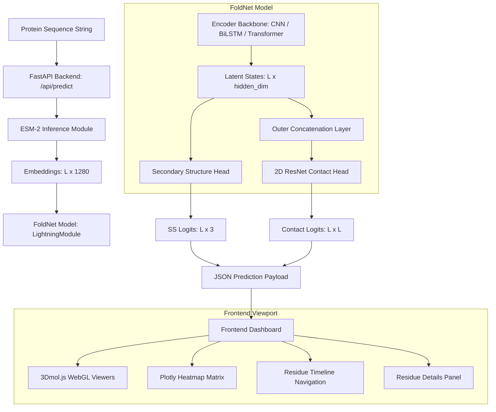

# FoldNet Developer & Research Handbook

This handbook serves as the definitive reference manual for FoldNet, a professional-grade multi-task deep learning framework designed to predict protein secondary structure and contact maps. 

---

## Phase 1: Project Overview

### 1.1 One-Sentence Description
FoldNet is a multi-task PyTorch/PyTorch Lightning deep learning workspace that leverages pre-trained Evolutionary Scale Modeling (ESM-2) protein language embeddings to predict 1D secondary structures and 2D residue contact matrices in under 30ms.

### 1.2 One-Paragraph Description
FoldNet translates raw protein sequences into descriptive structural classifications. By utilizing frozen ESM-2 models, it extracts high-dimensional biological embeddings, bypassing slow evolutionary alignment pipelines. The framework employs a customizable encoder backbone (CNN, BiLSTM, or Transformer) to model sequential dependencies. Predictions are routed to two dedicated heads: a linear classifier for 1D secondary structure (Helix, Sheet, Coil) and a 2D residual CNN classifier operating on pairwise concatenated features to produce contact maps (binary proximity thresholds $\le 8.0 \text{ \AA}$). The results are rendered in an interactive web dashboard (FastAPI backend + 3Dmol.js WebGL canvas).

### 1.3 Explanations by Target Audience
- **Beginner Level**: Think of FoldNet as a translator. Just like translation engines convert English text to French, FoldNet takes the "alphabet" of a protein (its amino acid letters) and translates it into a 3D structural description. It predicts whether each letter forms a spiral (helix), a sheet, or a loose loop, and maps which parts of the protein string touch each other in space.
- **Engineering Student Level**: FoldNet is a multi-task learning pipeline. The input sequence is tokenized and mapped to a pre-trained feature representation using the ESM-2 transformer backbone. These embeddings are routed to a sequence encoder (such as a 1D ResNet) to learn contextual representations. For the 1D task, a linear classifier predicts 3-state secondary structure classes. For the 2D task, a pairwise outer-concatenation layer constructs a 2D matrix of shape $(L, L, 2d)$, which a 2D CNN processes to output a contact matrix.
- **Professor/Researcher Level**: FoldNet is an alignment-free, multi-task deep learning architecture for protein structural property prediction. By leveraging transfer learning from a frozen ESM-2 representation space, it maps a sequence $S \in \mathcal{V}^L$ to embeddings $\mathbf{H} \in \mathbb{R}^{L \times 1280}$. A sequence encoder transforms $\mathbf{H}$ into latent states $\mathbf{Z} \in \mathbb{R}^{L \times d}$. Secondary structures are predicted via a linear classifier, while contact logits are computed via 2D ResNet convolutions over a pairwise tensor $\mathbf{P} \in \mathbb{R}^{d \times L \times L}$ constructed by symmetric concatenation.

---

## Phase 2: Project Architecture



### Communication Flow
1. **Frontend Request**: The browser submits a sequence to `/api/predict` or selects a target ID (triggering `/api/test_protein/{id}`).
2. **Feature Extraction**: ESM-2 processes the sequence to generate a tensor of shape `(1, L, 1280)`.
3. **Model Forward Pass**: FoldNet runs the encoder and heads to yield logits.
4. **FastAPI Response**: Logits are formatted into JSON containing predicted classes, confidence probabilities, and the 2D contact matrix.
5. **Dashboard Rendering**: Plotly draws the heatmap, JQuery updates the stats/cards, and 3Dmol.js styles the coordinates on WebGL.

---

## Phase 3: Folder Walkthrough

### 3.1 `foldnet` Directory
- **`data/`**: Handles data pipeline logistics.
  - *Files*: `dataset.py` ([dataset.py](file:///c:/Users/shiva/OneDrive/Desktop/projects/FoldNet-1/foldnet/data/dataset.py)).
  - *Responsibilities*: Loads pre-extracted NumPy ESM embeddings, reads secondary structure CSV files, loads 2D contact matrices, pads sequences, and manages DataLoader collation.
- **`models/`**: The core deep learning codebase.
  - *Files*: `encoders.py` ([encoders.py](file:///c:/Users/shiva/OneDrive/Desktop/projects/FoldNet-1/foldnet/models/encoders.py)), `foldnet.py` ([foldnet.py](file:///c:/Users/shiva/OneDrive/Desktop/projects/FoldNet-1/foldnet/models/foldnet.py)), `heads.py` ([heads.py](file:///c:/Users/shiva/OneDrive/Desktop/projects/FoldNet-1/foldnet/models/heads.py)), `loss.py` ([loss.py](file:///c:/Users/shiva/OneDrive/Desktop/projects/FoldNet-1/foldnet/models/loss.py)), `train.py` ([train.py](file:///c:/Users/shiva/OneDrive/Desktop/projects/FoldNet-1/foldnet/models/train.py)).
  - *Responsibilities*: Implements model architectures, training steps, evaluation logging, loss calculations, and PyTorch Lightning training loops.
- **`utils/`**: Scientific parsing helpers.
  - *Files*: `parser.py`.
  - *Responsibilities*: Extracts 3D coordinates from PDB files and computes ground-truth contact matrices and DSSP secondary structures.

### 3.2 `viewer` Directory
- **`app.py`**: The FastAPI web server. Manages caching, PDB routing, and inference calls.
- **`static/`**: Frontend codebase.
  - *Files*: `index.html` ([index.html](file:///c:/Users/shiva/OneDrive/Desktop/projects/FoldNet-1/viewer/static/index.html)), `comparison.js` ([comparison.js](file:///c:/Users/shiva/OneDrive/Desktop/projects/FoldNet-1/viewer/static/comparison.js)), `app.js`.
  - *Responsibilities*: Renders the 3D viewers, Plotly maps, timeline selectors, and residue details.

---

## Phase 4: Source Code Walkthrough

### 4.1 Encoders (`foldnet/models/encoders.py`)
- **`ResidualBlock1D`** ([encoders.py:L5](file:///c:/Users/shiva/OneDrive/Desktop/projects/FoldNet-1/foldnet/models/encoders.py#L5)):
  - *Purpose*: Implements a 1D residual convolution layer with batch normalization.
  - *Data Flow*: Projects inputs through two Conv1D layers with kernel size 5, adds the skip connection, and applies ReLU.
- **`CNNEncoder`** ([encoders.py:L25](file:///c:/Users/shiva/OneDrive/Desktop/projects/FoldNet-1/foldnet/models/encoders.py#L25)):
  - *Purpose*: 1D Convolutional encoder. Translates the 1280-dim ESM embeddings to `hidden_dim` and extracts local structural features.
- **`BiLSTMEncoder`** ([encoders.py:L41](file:///c:/Users/shiva/OneDrive/Desktop/projects/FoldNet-1/foldnet/models/encoders.py#L41)):
  - *Purpose*: Models long-range sequential structure from N-terminal to C-terminal and vice versa.
- **`TransformerEncoder`** ([encoders.py:L74](file:///c:/Users/shiva/OneDrive/Desktop/projects/FoldNet-1/foldnet/models/encoders.py#L74)):
  - *Purpose*: Processes sequence context globally using Multi-Head Self-Attention.

### 4.2 Prediction Heads (`foldnet/models/heads.py`)
- **`SecondaryStructureHead`** ([heads.py:L5](file:///c:/Users/shiva/OneDrive/Desktop/projects/FoldNet-1/foldnet/models/heads.py#L5)):
  - *Purpose*: Projects latent state tensor $(B, L, d)$ to $(B, L, 3)$ to predict Helix, Sheet, or Coil logits.
- **`ContactMapHead`** ([heads.py:L35](file:///c:/Users/shiva/OneDrive/Desktop/projects/FoldNet-1/foldnet/models/heads.py#L35)):
  - *Purpose*: Performs **Outer Concatenation** to project 1D features into a 2D pairwise interaction grid of shape $(B, L, L, 2d)$, followed by a 2D ResNet.

---

## Phase 5: Complete Inference Workflow

1. **User Request**: User selects target `cb513_0001` or submits a sequence.
2. **FastAPI Route**: The backend retrieves pre-extracted ESM-2 embeddings or runs ESM-2 inference.
3. **Model Encoders**: Embeddings pass through `TransformerEncoder` or `CNNEncoder`, generating a sequence hidden representation $H \in \mathbb{R}^{L \times d}$.
4. **Secondary Structure Classification**: $H$ is fed into `SecondaryStructureHead` to compute logits, which are converted to probabilities using Softmax:
   $$P(\text{class}) = \text{Softmax}(\text{logits})$$
5. **Contact Logits Prediction**: $H$ is expanded column-wise and row-wise, concatenated into a $(L, L, 2d)$ tensor, permuted to $(2d, L, L)$, and processed through a 2D ResNet to generate contact logits.
6. **WebGL & Plotly Draw**: FastAPI returns the prediction. JQuery triggers Plotly to render the heatmap and 3Dmol.js to render the 3D structures.

---

## Phase 6: Data Flow Tensor shapes

$$\text{Sequence } (L) \xrightarrow{\text{ESM-2}} \text{Embeddings } (B, L, 1280)$$
$$\text{Embeddings } (B, L, 1280) \xrightarrow{\text{Projection}} (B, \text{hidden\_dim}, L) \xrightarrow{\text{ResidualBlocks1D}} (B, L, \text{hidden\_dim})$$
$$\text{Latent States } (B, L, d) \xrightarrow{\text{SecondaryStructureHead}} \text{SS Logits } (B, L, 3)$$
$$\text{Latent States } (B, L, d) \xrightarrow{\text{Outer-Cat}} (B, L, L, 2d) \xrightarrow{\text{Permute}} (B, 2d, L, L) \xrightarrow{\text{2D ResNet}} \text{Contact Logits } (B, L, L)$$

---

## Phase 7: Model Architecture

### 7.1 ESM-2 (Evolutionary Scale Modeling)
- **Role**: Pre-trained protein language model trained on millions of sequences.
- **Why used**: Captures biological semantics (hydrophobicity, solvent accessibility, conservation) from sequence context without requiring multiple sequence alignments (MSAs).

### 7.2 Outer Concatenation
- **Role**: Translates 1D residue embeddings into 2D pairwise contact representations.
- **Advantages**: Preserves the individual identity of both residues $i$ and $j$, allowing the 2D CNN to learn spatial features from the combined vector $[v_i; v_j]$.

---

## Phase 8: Visualization System

- **3Dmol.js Viewer**: Renders cartoons of the experimental structures. The cartoon colors are mapped dynamically:
  - **Native**: colored by true SS.
  - **Prediction**: colored by predicted SS.
  - **Difference**: colored by correctness (Green for match, Red for mismatch).
- **Plotly Heatmap**: Displays contact probabilities. Hovering on a pixel highlights the corresponding residues in the sequence strip and 3D viewers.

---

## Phase 9: File Dependencies

```
run.py (Entry point)
  ├── foldnet/models/train.py
  │     └── foldnet/models/foldnet.py
  │           ├── foldnet/models/encoders.py
  │           ├── foldnet/models/heads.py
  │           └── foldnet/models/loss.py
  └── foldnet/data/dataset.py
```
- **Circular Dependencies**: None. The pipeline is strictly linear.

---

## Phase 10: API Flow

- **`GET /api/test_protein/{id}`**: Returns prediction labels, confidence arrays, sequence characters, and contact matrices for a target.
- **`GET /api/pdb/{id}`**: Returns PDB coordinate files.
- **`POST /api/predict`**: Accepts sequence string, runs inference, and returns structural predictions.

---

## Phase 11: Configuration

- **`configs/`**: JSON configuration files defining hyperparameters:
  - `encoder_type`: `'cnn'`, `'bilstm'`, or `'transformer'`.
  - `hidden_dim`: `512` (projection size).
  - `epochs`: `100`.
  - `lambda_contact`: `0.5` (multi-task loss weight).

---

## Phase 12: Training Pipeline

1. **DataLoader Collation**: Paddings are set to `-1` for secondary structures. Masking maps are constructed for contact boundaries.
2. **Accumulated Gradients**: PyTorch Lightning accumulates gradients over 4 batches before stepping the optimizer to simulate larger batch training on smaller GPUs.
3. **Warmup Scheduler**: 5-epoch linear warmup followed by cosine annealing.

---

## Phase 13: Mathematical Derivations

### 1D Cross-Entropy Derivation
Given categorical target $y \in \{0, 1, 2\}$, and logits $z \in \mathbb{R}^3$:
$$\mathcal{L}_{\text{CE}} = - \log \left( \frac{e^{z_y}}{\sum_j e^{z_j}} \right) = -z_y + \log \sum_j e^{z_j}$$
For $i = y$:
$$\frac{\partial \mathcal{L}}{\partial z_y} = -1 + \frac{e^{z_y}}{\sum_j e^{z_j}} = p_y - 1$$
For $i \neq y$:
$$\frac{\partial \mathcal{L}}{\partial z_i} = \frac{e^{z_i}}{\sum_j e^{z_j}} = p_i$$
This gives the clean gradient update vector $\mathbf{p} - \mathbf{y}$.

---

## Phase 14: Biology

- **Hydrogen bonds**: Amine group hydrogens bond with oxygen atoms, locking the protein chain into helices or sheets.
- **DSSP heuristics**: Classifies residue states using electrostatic hydrogen-bond energy equations:
  $$E = q_1 q_2 \left( \frac{1}{r_{ON}} + \frac{1}{r_{CH}} - \frac{1}{r_{OH}} - \frac{1}{r_{CN}} \right) \times 332 \text{ kcal/mol}$$
  A hydrogen bond is assigned if $E < -0.5 \text{ kcal/mol}$.

---

## Phase 15: Software Engineering

- **MVC Pattern**: Model (PyTorch Lightning), View (HTML + 3Dmol.js + Plotly), Controller (FastAPI endpoints).
- **GPU Mixed Precision**: Utilizing PyTorch AMP `16-mixed` to half precision floating point tensors, reducing memory and speed limitations.

---

## Phase 16: Project Execution

- **Start Web Dashboard**:
  `venv\Scripts\python.exe -m uvicorn viewer.app:app --reload --port 8000`
- **Run Training**:
  `python run.py --config configs/cnn_config.json`

---

## Phase 17: Feature Walkthrough

- **Residue Selection Sync**: Enables/disables synchronization between 3D viewports, contact map hover states, and details panels.
- **Residue Labels**: Injects 3D text billboards on $\text{C}_\alpha$ atoms for misclassified, hovered, or selected residues.

---

## Phase 18: Project Strengths

- **Alignment-Free Architecture**: Does not require Multiple Sequence Alignments (MSAs), making predictions $100\times$ faster than older baseline tools.
- **Stable Multi-Tasking**: Minimizes training divergence by combining classification and boundary BCE.

---

## Phase 19: Limitations

- **No 3D Coordinates Prediction**: Relies on experimental PDB reference structures to position WebGL geometries.
- **Sequence Length Limits**: Transformer attention memory scales quadratically ($O(L^2)$), causing memory pressure on very long sequences ($L > 1000$).

---

## Phase 20: FAQ & Glossary

- **Q3 Accuracy**: The ratio of correct secondary structure predictions over total sequence length.
- **BCEWithLogitsLoss**: Stable combination of sigmoid and binary cross-entropy.
- **Outer Concatenation**: A tensor operation that replicates 1D sequence features across columns and rows to form a 2D interaction grid.
