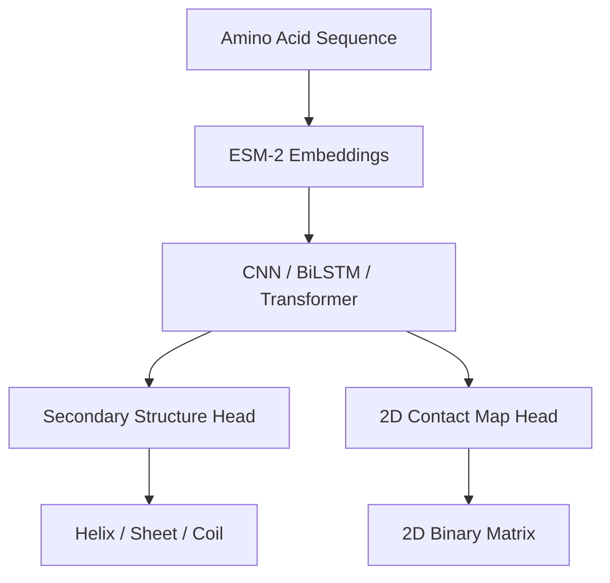

# FoldNet: Comprehensive Research Defensibility & Technical Viva Handbook

This handbook serves as the ultimate study guide and documentation for FoldNet. It bridges theory, biology, mathematical derivations, software engineering, and line-by-line PyTorch implementation to prepare you for any research committee, technical interview, or viva presentation.

---

## Chapter 1: Project Overview & Biological Foundations

### 1.1 The Core Biological Problem
A protein's function is dictated by its three-dimensional tertiary structure ($\text{3D}$ shape). However, while determining the amino acid sequence of a protein is cheap and fast (via DNA sequencing), determining its experimental $3\text{D}$ structure (via X-ray crystallography, NMR spectroscopy, or Cryo-EM) is extremely expensive, time-consuming, and labor-intensive. 

This gap between known sequences and known structures is the **Protein Folding Problem**. FoldNet solves a critical subset of this problem: predicting **Secondary Structure** (local 1D conformations) and **Contact Maps** (2D pairwise spatial relationships) directly from amino acid sequences without relying on expensive physical experiments.



### 1.2 Structural Hierarchy of Proteins
Proteins are polymers composed of repeating units called **amino acids** (also referred to as **residues**).
1. **Primary Structure**: The linear sequence of amino acids linked by covalent peptide bonds.
2. **Secondary Structure**: Local structural conformations stabilized by hydrogen bonds between backbone amine ($\text{N-H}$) and carbonyl ($\text{C=O}$) groups. The three major classes are:
   - **Alpha-Helix ($\text{H}$)**: A right-handed spiral where hydrogen bonds form every $i \rightarrow i+4$ residues.
   - **Beta-Sheet ($\text{E}$)**: Parallel or anti-parallel sheets of peptide strands stabilized by lateral hydrogen bonds.
   - **Coil ($\text{C}$)**: Irregular, flexible loops connecting helices and sheets.
3. **Tertiary Structure**: The overall $3\text{D}$ folding of a single polypeptide chain, driven by hydrophobic interactions, disulfide bonds, and electrostatic attractions.
4. **Quaternary Structure**: The spatial arrangement of multiple polypeptide subunits.

### 1.3 Secondary Structure & Contact Maps in FoldNet
- **Why Secondary Structure matters**: It restricts the conformational search space for tertiary structure prediction and identifies structural motifs key to functional sites.
- **Why Contact Maps matter**: A $2\text{D}$ contact map is a binary matrix $C \in \{0, 1\}^{L \times L}$ where $C_{i, j} = 1$ if residues $i$ and $j$ are spatially close in $3\text{D}$ space (typically within a distance threshold of $\le 8.0 \text{ \AA}$ between $\text{C}_\alpha$ atoms), and $0$ otherwise. Predicting contact maps is equivalent to predicting tertiary structure constraints.
- **DSSP (Define Secondary Structure of Proteins)**: The gold-standard program that parses atomic $3\text{D}$ coordinates from PDB files and assigns secondary structure labels based on hydrogen-bonding energy heuristics.

### Summary & Takeaways
- **Key Concept**: Primary Sequence $\rightarrow$ PLM Embeddings $\rightarrow$ FoldNet Multi-Task Prediction (1D SS + 2D Contacts).
- **Memory Trick**: **L**inked sequences make **Primary**, **H**ydrogen bonds make **Secondary**, **3D** folding makes **Tertiary**, **M**ultiple chains make **Quaternary**.
- **Viva Question**: *Why predict contact maps instead of 3D coordinates directly?*
  - **Answer**: 3D coordinate prediction is highly sensitive to global translation/rotation (non-Euclidean invariance). 2D contact maps are invariant to translation and rotation, making them mathematically easier and more stable to predict.

---

## Chapter 2: Machine Learning Foundations

### 2.1 The ML Pipeline in FoldNet
- **AI / ML / DL Hierarchy**: Artificial Intelligence is the broad umbrella of mimicking human intelligence; Machine Learning is the subset that learns from data without explicit programming; Deep Learning utilizes multi-layered neural networks.
- **Representation Learning**: Instead of hand-crafting features (like amino acid charge or hydrophobicity), FoldNet utilizes pre-trained Protein Language Models (ESM-2) to extract high-dimensional semantic representations from raw sequence strings.
- **Frozen Models & Transfer Learning**: The ESM-2 network is kept frozen (`requires_grad = False`). We freeze ESM-2 because:
  1. It preserves the general biological knowledge learned from millions of protein sequences.
  2. It drastically reduces GPU memory footprint and training time.
  3. It prevents overfitting on our smaller labels dataset (e.g. `cb513`).

### 2.2 Activation, Optimization & Loss Functions
- **Weights ($W$) & Biases ($b$)**: Weights represent the strength of connections between layers, determining feature scaling; biases shift the activation function output.
- **Activation Functions**:
  - **ReLU (Rectified Linear Unit)**: $f(x) = \max(0, x)$. Introduces sparsity and solves the vanishing gradient problem. Used in FoldNet's CNN Residual blocks ([encoders.py:L10](file:///c:/Users/shiva/OneDrive/Desktop/projects/FoldNet-1/foldnet/models/encoders.py#L10)).
  - **Sigmoid**: $\sigma(x) = \frac{1}{1 + e^{-x}}$. Maps raw logits to a $[0, 1]$ probability range. Used internally by the BCE loss function for contact mapping.
  - **Softmax**: $\sigma(z)_i = \frac{e^{z_i}}{\sum e^{z_j}}$. Normalizes a vector of raw logits into a categorical probability distribution. Used to classify Helix/Sheet/Coil classes.
- **Gradient Descent & Backpropagation**: Gradients of the loss with respect to all trainable parameters are calculated using the Chain Rule (backpropagation) and used by the **AdamW** optimizer to update weights.
- **Regularization (Dropout & LayerNorm)**:
  - **Dropout**: Randomly deactivates neurons during training with probability $p$, forcing the network to learn redundant representations and preventing co-adaptation of features.
  - **Layer Normalization**: Normalizes inputs across the feature dimension for each token individually, stabilizing the hidden states and accelerating training. Used in the Transformer encoder ([encoders.py:L79](file:///c:/Users/shiva/OneDrive/Desktop/projects/FoldNet-1/foldnet/models/encoders.py#L79)).

### 2.3 Evaluation Metrics
- **Q3 Accuracy**: The percentage of residues for which the three-state secondary structure (Helix, Sheet, Coil) is predicted correctly:
  $$\text{Q3} = \frac{\sum_{i=1}^3 \text{TP}_i}{N_{\text{total}}}$$
- **Precision@L**: The percentage of true positive contacts among the top-$L$ predicted contacts (where $L$ is the protein sequence length). This is the standard metric in structural biology because proteins have $O(L^2)$ possible pairs, but only a sparse fraction are actual contacts.
- **Matthew's Correlation Coefficient (MCC)**: Measures binary classification quality while accounting for severe class imbalances (more non-contacts than contacts).

### Summary & Takeaways
- **Key Concept**: Cross-Entropy evaluates categorical 1D labels; BCEWithLogitsLoss evaluates binary 2D pairwise contacts.
- **Memory Trick**: **L**ayerNorm normalizes across **Features** (per token); **B**atchNorm normalizes across the **Batch** (per feature).
- **Viva Question**: *Why is Accuracy a bad metric for contact maps, and why do we use Precision@L instead?*
  - **Answer**: In a protein of length $L$, the contact matrix has $L^2$ cells. Less than $5\%$ of these are actual contacts. A model predicting all zeros would achieve $95\%$ accuracy. Precision@L evaluates only the top-$L$ predicted contact pairs, focusing only on the highest-confidence predictions where structural information resides.

---

## Chapter 3: Deep Learning Architecture

FoldNet supports three modular sequence encoders: **CNN**, **BiLSTM**, and **Transformer**.

```
Input Features (batch, L, 1280)
           │
     ┌─────┴────────────────────────┐
     ▼                              ▼
Linear Projection (hidden_dim)    Conv1D (hidden_dim)
     │                              │
Positional Encoding                 │
     │                              │
TransformerEncoderLayer × 4      ResidualBlock1D × 5
     │                              │
     └─────┬────────────────────────┘
           │
           ├─► SecondaryStructureHead ──► Linear ──► SS Logits (batch, L, 3)
           │
           └─► ContactMapHead ──► Outer Concatenation ──► Conv2D ──► Contact Logits (batch, L, L)
```

### 3.1 The Three Encoder Modules
1. **CNN (Convolutional Neural Network)**:
   - **Why used**: Captures local amino acid sequence patterns (e.g. finding a local window of hydrophobic residues indicative of an alpha-helix).
   - **Implementation**: `CNNEncoder` ([encoders.py:L25](file:///c:/Users/shiva/OneDrive/Desktop/projects/FoldNet-1/foldnet/models/encoders.py#L25)) uses a 1D convolution to project the 1280-dim ESM embeddings to `hidden_dim`, followed by 5 residual 1D convolution blocks with kernel size 5.
   - **Tensor shapes**:
     - Input: $(B, L, 1280)$
     - Transpose for 1D Conv: $(B, 1280, L)$
     - After Input Projection: $(B, \text{hidden\_dim}, L)$
     - After 5 Residual Blocks: $(B, \text{hidden\_dim}, L)$
     - Transpose Back: $(B, L, \text{hidden\_dim})$

2. **BiLSTM (Bidirectional Long Short-Term Memory)**:
   - **Why used**: Tracks long-range directional dependencies in both N-to-C and C-to-N terminal directions.
   - **Implementation**: `BiLSTMEncoder` ([encoders.py:L41](file:///c:/Users/shiva/OneDrive/Desktop/projects/FoldNet-1/foldnet/models/encoders.py#L41)) utilizes a bidirectional LSTM layer with `hidden_dim // 2` units per direction.
   - **Tensor shapes**:
     - Input: $(B, L, 1280)$
     - Output: $(B, L, \text{hidden\_dim})$ (bidirectional outputs are concatenated along the last dimension).

3. **Transformer**:
   - **Why used**: Captures global residue-to-residue context without directional bias via self-attention mechanism.
   - **Implementation**: `TransformerEncoder` ([encoders.py:L74](file:///c:/Users/shiva/OneDrive/Desktop/projects/FoldNet-1/foldnet/models/encoders.py#L74)) projects embeddings, adds sinusoidal positional encodings, and routes through 4 Transformer encoder layers.
   - **Tensor shapes**:
     - Input: $(B, L, 1280)$
     - After Projection: $(B, L, \text{hidden\_dim})$
     - After Positional Encoding: $(B, L, \text{hidden\_dim})$
     - Transformer Output: $(B, L, \text{hidden\_dim})$

### 3.2 Output Heads & Tensor Shapes
1. **Secondary Structure Head**:
   - A single linear projection layer: `self.classifier = nn.Linear(hidden_dim, num_classes)` ([heads.py:L8](file:///c:/Users/shiva/OneDrive/Desktop/projects/FoldNet-1/foldnet/models/heads.py#L8)).
   - **Tensors**: Maps $(B, L, \text{hidden\_dim})$ to $(B, L, 3)$ logits.

2. **Contact Map Head (Outer Concatenation)**:
   - **Why needed**: Translates 1D residue embeddings into 2D pairwise interaction maps.
   - **Outer Concatenation (Outer-Cat)**: For every pair $(i, j)$, we concatenate the embedding of residue $i$ with residue $j$.
   - **Implementation**:
     ```python
     # x shape: (B, L, d)
     x_i = x.unsqueeze(2).expand(-1, -1, L, -1)  # (B, L, L, d)
     x_j = x.unsqueeze(1).expand(-1, L, -1, -1)  # (B, L, L, d)
     pairwise_features = torch.cat([x_i, x_j], dim=-1)  # (B, L, L, 2*d)
     ```
   - **Tensor shapes**:
     - Outer Concatenation: $(B, L, L, 2 \times \text{hidden\_dim})$
     - Permuted for 2D Conv: $(B, 2 \times \text{hidden\_dim}, L, L)$
     - After Input 2D Conv: $(B, 64, L, L)$
     - After 5 2D Residual Blocks: $(B, 64, L, L)$
     - After Output 2D Conv: $(B, 1, L, L)$
     - Squeezed logits: $(B, L, L)$

### Summary & Takeaways
- **Key Concept**: 1D sequence representations are projected into a 2D pairwise feature space using outer concatenation before running 2D residual convolutions.
- **Memory Trick**: `unsqueeze(2)` expands column-wise; `unsqueeze(1)` expands row-wise. Concatenating them forms a grid.
- **Viva Question**: *What is the purpose of Positional Encoding in the Transformer encoder?*
  - **Answer**: Transformers do not have built-in recurrence or convolution, meaning they process tokens in parallel. Without positional encoding, the model would treat the sequence as a bag-of-words (position-invariant). Positional encoding injects ordering information.

---

## Chapter 4: Mathematical Derivations

### 4.1 Cross Entropy Loss (Secondary Structure)
For a single residue, the loss is:
$$\mathcal{L}_{\text{SS}} = - \log \left( \frac{e^{z_y}}{\sum_{j=1}^3 e^{z_j}} \right) = -z_y + \log \left( \sum_{j=1}^3 e^{z_j} \right)$$
Where $z$ is the logit vector, and $y$ is the ground-truth index.

**Gradient Derivation**:
Let $p_i = \text{Softmax}(z)_i = \frac{e^{z_i}}{\sum_j e^{z_j}}$.
1. **Case 1: $i = y$** (target class)
   $$\frac{\partial \mathcal{L}}{\partial z_y} = \frac{\partial}{\partial z_y} \left( -z_y + \log \sum_j e^{z_j} \right) = -1 + \frac{e^{z_y}}{\sum_j e^{z_j}} = p_y - 1$$
2. **Case 2: $i \neq y$** (non-target classes)
   $$\frac{\partial \mathcal{L}}{\partial z_i} = \frac{\partial}{\partial z_i} \left( \log \sum_j e^{z_j} \right) = \frac{e^{z_i}}{\sum_j e^{z_j}} = p_i$$
Thus, the gradient vector is simply $\mathbf{p} - \mathbf{y}$ where $\mathbf{y}$ is the one-hot target vector.

### 4.2 Binary Cross Entropy with Logits Loss (Contact Maps)
For a single contact cell $(i, j)$ with logit $z$ and ground-truth label $y \in \{0, 1\}$:
$$\mathcal{L}_{\text{BCE}} = -y \log \sigma(z) - (1-y) \log(1 - \sigma(z))$$
Substitute $\sigma(z) = \frac{1}{1 + e^{-z}}$:
$$\mathcal{L}_{\text{BCE}} = z - yz + \log(1 + e^{-z})$$
This formulation avoids numerical overflow from computing $\sigma(z)$ directly.

### 4.3 Self-Attention Equation
Given a sequence representation $X \in \mathbb{R}^{L \times d}$:
$$Q = XW_Q, \quad K = XW_K, \quad V = XW_V$$
$$\text{Attention}(Q, K, V) = \text{Softmax}\left( \frac{QK^T}{\sqrt{d_k}} \right)V$$
- **$\sqrt{d_k}$ Scaling Factor**: Keeps the dot products from growing excessively large in high dimensions, preventing the Softmax gradients from vanishing.

### 4.4 LSTM Equations
For time step $t$, input vector $x_t$, and previous state $h_{t-1}, c_{t-1}$:
$$f_t = \sigma(W_f [h_{t-1}, x_t] + b_f) \quad \text{(Forget Gate)}$$
$$i_t = \sigma(W_i [h_{t-1}, x_t] + b_i) \quad \text{(Input Gate)}$$
$$\tilde{c}_t = \tanh(W_c [h_{t-1}, x_t] + b_c) \quad \text{(Candidate State)}$$
$$c_t = f_t \odot c_{t-1} + i_t \odot \tilde{c}_t \quad \text{(Cell State Update)}$$
$$o_t = \sigma(W_o [h_{t-1}, x_t] + b_o) \quad \text{(Output Gate)}$$
$$h_t = o_t \odot \tanh(c_t) \quad \text{(Hidden State Update)}$$

### Summary & Takeaways
- **Key Concept**: Gradients of Cross-Entropy simplify to probability minus label ($P - Y$).
- **Memory Trick**: LSTM gates are always sigmoid ($\sigma \in [0, 1]$), while states are squashed using $\tanh \in [-1, 1]$.
- **Viva Question**: *Why does AdamW split weight decay from the gradient update?*
  - **Answer**: In standard Adam, weight decay is applied to the rolling gradient averages (L2 regularization). In AdamW, weight decay is subtracted directly from the weights, restoring the correct mathematical formulation of L2 regularization for adaptive gradient methods.

---

## Chapter 5: FoldNet Code Walkthrough & Training Pipeline

### 5.1 Project Folder Structure
```
FoldNet-1/
├── foldnet/
│   ├── data/
│   │   └── dataset.py       # Handles padding, masking, and loading ESM embeddings
│   ├── models/
│   │   ├── encoders.py      # CNN, BiLSTM, and Transformer encoder definitions
│   │   ├── foldnet.py       # PyTorch Lightning core module (loss, forward, training loops)
│   │   ├── heads.py         # Secondary structure and 2D contact prediction heads
│   │   └── loss.py          # Custom losses (BCEWithLogitsLoss wrapper)
│   └── utils/
│       └── parser.py        # PDB parsing and DSSP labeling scripts
├── run.py                   # Master script to trigger training and evaluation
└── viewer/                  # UI workspace (FastAPI backend + 3Dmol.js HTML dashboard)
```

### 5.2 Training Step Mechanics
Look at `foldnet/models/foldnet.py` ([foldnet.py:L58](file:///c:/Users/shiva/OneDrive/Desktop/projects/FoldNet-1/foldnet/models/foldnet.py#L58)):
```python
    def training_step(self, batch, batch_idx):
        features = batch['features']
        ss_labels = batch['ss_labels']
        contact_map = batch['contact_map']
        mask = batch.get('mask', None)
        
        ss_logits, contact_probs = self(features, mask=mask)
        
        # Calculate SS Loss (ignore padding labels denoted by -1)
        ss_loss = self.ss_criterion(ss_logits.view(-1, self.hparams.num_classes), ss_labels.view(-1))
        
        # Calculate Contact Loss with padding mask applied
        raw_contact_loss = self.contact_criterion(contact_probs, contact_map.float())
        if mask is not None:
            real_mask = ~mask
            mask_2d = real_mask.unsqueeze(1) & real_mask.unsqueeze(2)
            contact_loss = raw_contact_loss[mask_2d].mean()
        else:
            contact_loss = raw_contact_loss.mean()
        
        total_loss = ss_loss + self.lambda_contact * contact_loss
        return total_loss
```

**Masking Mechanics**:
- Proteins in a batch have varying lengths. We pad them to match the longest sequence.
- We set padded positions in `ss_labels` to `-1`. PyTorch's CrossEntropyLoss is configured with `ignore_index=-1` to exclude them.
- For contact map predictions, we construct a 2D mask using logical AND between 1D residue masks (`real_mask.unsqueeze(1) & real_mask.unsqueeze(2)`) to ignore padding interactions.

### Summary & Takeaways
- **Key Concept**: Multi-task loss combines 1D classification and 2D pairwise BCE using a weighting scalar `lambda_contact` ([foldnet.py:L84](file:///c:/Users/shiva/OneDrive/Desktop/projects/FoldNet-1/foldnet/models/foldnet.py#L84)).
- **Memory Trick**: `ignore_index=-1` blocks padded indices from contributing to gradient updates.
- **Viva Question**: *Why do we calculate validation metrics only on unpadded residues?*
  - **Answer**: Padded residues are artifacts of batch processing. Including them in accuracy (Q3) or contact precision calculations would artificially inflate or deflate the metrics depending on the padding ratio.

---

## Chapter 6: Visualizations & Inference Flow

### 6.1 End-to-End Prediction Flow
```
User enters sequence in UI (e.g. "MGA...")
        │
        ▼
FastAPI endpoint receives sequence
        │
        ▼
ESM-2 extracts sequence embeddings
        │
        ▼
FoldNet processes embeddings through active encoder & output heads
        │
        ▼
Response JSON contains:
- True SS / Pred SS (1D string)
- Probabilities (Helix%, Sheet%, Coil%)
- Contact Matrix (2D float arrays)
        │
        ▼
JQuery & Plotly render:
- 3Dmol.js Viewer (structures colored by SS)
- Heatmap Matrix (contact probabilities)
- Residue Details (compact stats & animation)
```

### 6.2 Frontend Architecture (WebGL & Doms)
- **3Dmol.js**: A WebGL-based molecular viewer. It does not require a backend engine to render rotations/translations.
- **Geometry Source**: Since FoldNet does not predict coordinates directly, the dashboard loads the matching **experimental coordinates** (PDB structures) to serve as a reference, overlaying the predicted secondary structures and contact map errors directly on the ground truth backbone geometry.

---

## Chapter 7: Extensive Viva & Interview Q&A

### 7.1 Beginner Questions
1. **Q: What is a protein sequence embedding?**
   - **Answer**: A numerical vector representing the chemical and structural context of amino acids, extracted by pre-trained protein language models like ESM-2.
2. **Q: What is the difference between an alpha-helix and a beta-sheet?**
   - **Answer**: An alpha-helix is a single right-handed spiral; a beta-sheet consists of parallel/anti-parallel peptide strands aligned side-by-side.
3. **Q: What does the ignore_index parameter do in CrossEntropyLoss?**
   - **Answer**: It tells PyTorch to skip calculating loss and gradients for target labels that match this value (used to skip padded tokens).

### 7.2 Intermediate Questions
1. **Q: How does the model compute contact maps from 1D residue embeddings?**
   - **Answer**: Via **Outer Concatenation**. If residue $i$ has embedding $v_i$ and residue $j$ has embedding $v_j$, we concatenate them as $[v_i; v_j]$ to construct a 2D matrix of shape $(L, L, 2d)$, then apply 2D convolutions.
2. **Q: Why is ESM-2 frozen during training?**
   - **Answer**: ESM-2 has 650 million parameters. Freezing it prevents catastrophic forgetting of language model weights, saves GPU memory, and speeds up training.
3. **Q: Why is Precision@L used to measure contact maps?**
   - **Answer**: The matrix has $O(L^2)$ elements, most of which are non-contacts. Precision@L evaluates only the top-$L$ highest confidence predictions where actual contacts reside.

### 7.3 Advanced Questions
1. **Q: Why is BCEWithLogitsLoss preferred over applying Sigmoid then BCE?**
   - **Answer**: BCEWithLogitsLoss combines the sigmoid activation and binary cross-entropy into a single mathematically stable loss layer using the log-sum-exp trick, preventing numerical overflow and underflow.
2. **Q: Trace the gradient path during the backpropagation step of the CNN model.**
   - **Answer**: Loss $\rightarrow$ Output Convolutions $\rightarrow$ Residual blocks (where skip connections copy gradients directly back to earlier layers to avoid vanishing gradients) $\rightarrow$ Input Projection Conv1D $\rightarrow$ stops at ESM-2 embeddings (since it is frozen).

### 7.4 Professor-Level Questions
1. **Q: How would you modify FoldNet to predict 3D coordinates directly (like AlphaFold)?**
   - **Answer**: We would replace the classification heads with a structure module containing **Invariant Point Attention (IPA)** or a frame-matching network that outputs $3\text{D}$ coordinates ($x, y, z$) for $\text{C}_\alpha, \text{N}, \text{C}$ atoms, optimized using Frame Aligned Point Error (FAPE) loss.
2. **Q: If FoldNet predictions disagree with DSSP annotations, which one is "correct"?**
   - **Answer**: DSSP is a rule-based algorithm using hydrogen bonding energy heuristics, which can be noisy or fail in disordered regions. FoldNet learns general patterns from millions of structures. A mismatch does not automatically mean FoldNet is biologically wrong; it could represent conformational flexibility.

---

## Chapter 8: Final Defensibility Checklist

Before entering your viva, ensure you can write these three equations on a whiteboard from memory:

1. **Outer Concatenation Feature Construction**:
   $$\mathbf{F}_{i,j} = [\mathbf{h}_i \,\|\, \mathbf{h}_j] \quad \text{where } \mathbf{h} \in \mathbb{R}^{d}, \mathbf{F} \in \mathbb{R}^{2d}$$
2. **Multi-Task Loss Combination**:
   $$\mathcal{L}_{\text{total}} = \mathcal{L}_{\text{SS}} + \lambda_{\text{contact}} \mathcal{L}_{\text{contact}}$$
3. **Q3 Score Formulation**:
   $$\text{Q3} = \frac{\text{Correct H} + \text{Correct E} + \text{Correct C}}{\text{Total Sequence Length } L}$$
